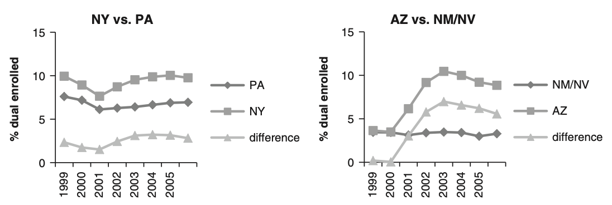
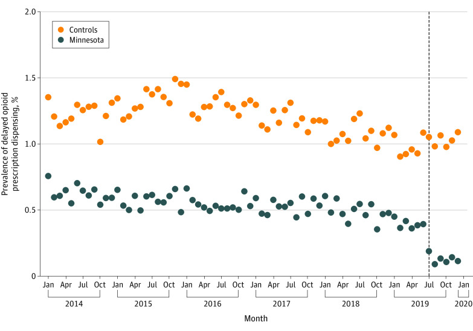
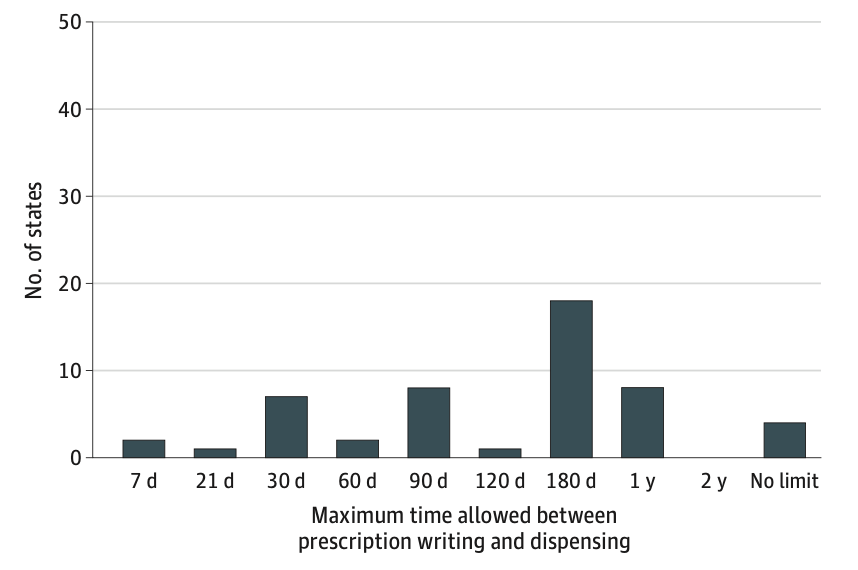
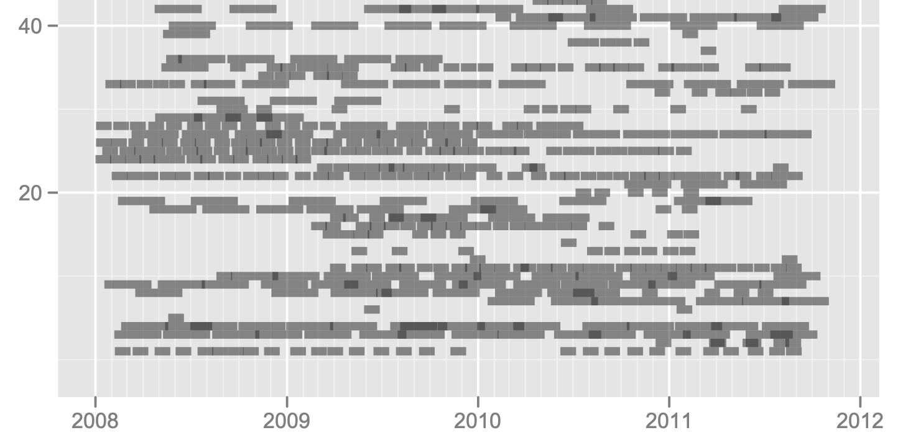
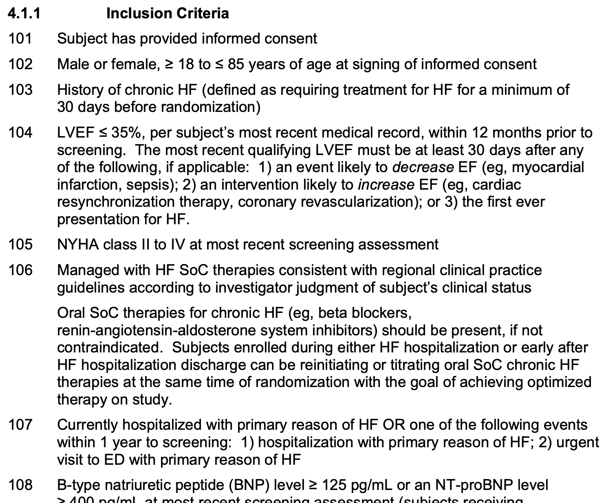
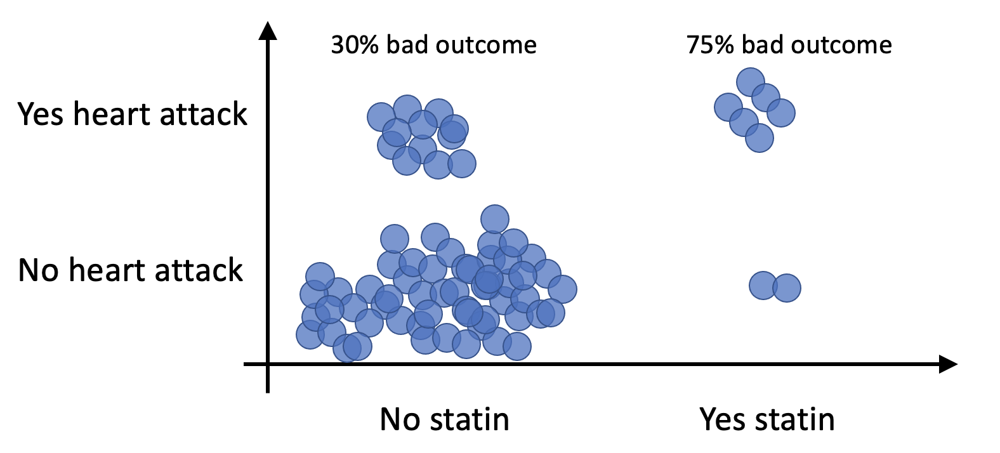
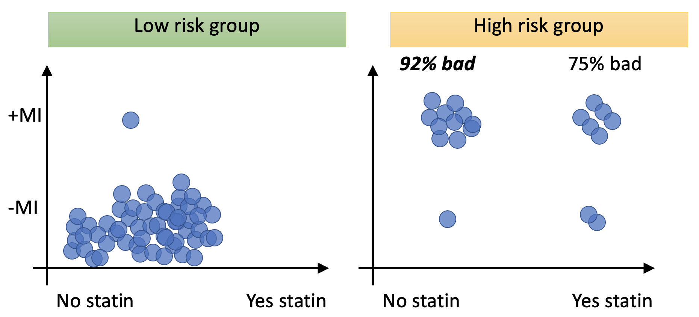
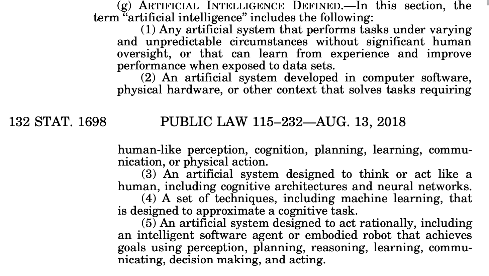
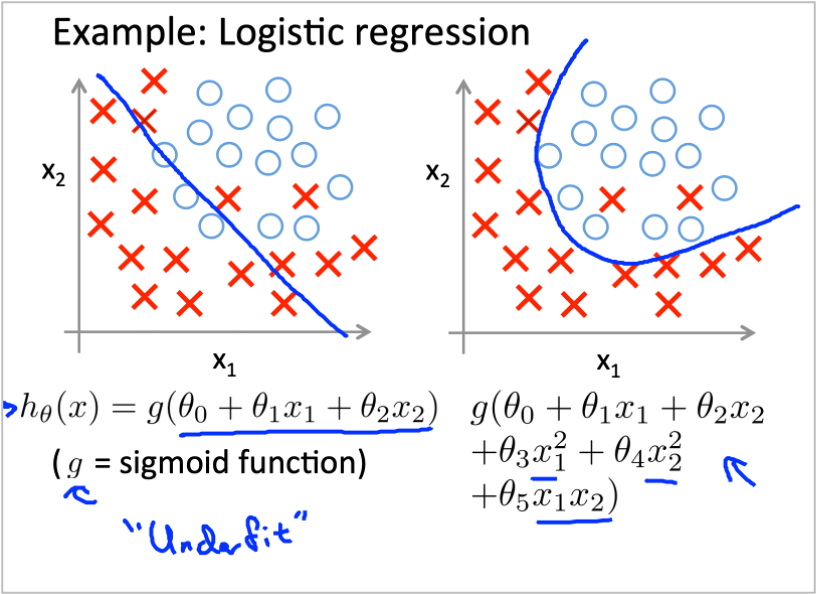

# Intro, & research *about* policy

## About me

| Yrs | Research activities                 | Clinical activities |
|-----|-------------------------------------|------------------------------|
| 3+1 | n/a                                 |  Internal medicine residency |
| 2+1 | MMSc biomedical informatics         | Outpatient urgent care |
| 4   | VA Boston: Clinical trials           | Hospitalist |
| 5   | VA Houston: Health services research | Hospitalist |

What is *Clinical research informatics?*

- I make various clinical research studies "go," using existing data.
- "Phenotyping" using electronic health record (EHR) data

## A detailed reference about secondary use[^MIT]

{ height=75% }

[^MIT]: MIT Critical Data. *Secondary Analysis of Electronic Health Records.*
Springer Cham, 2016. [Click for free access](https://link.springer.com/book/10.1007/978-3-319-43742-2)

## How I (an informatics person) look at these studies

- database type
- whose data?
- "pre" methods (how carefully did they do "phenotyping"?)
- study type (broadly)
- ...and oh yes, the details of "real" analysis methods and results

# 1: Medicaid expansion[^pom]

[^pom]: O'Mahen PN, Petersen LA. Effects of State-level Medicaid Expansion on
Veterans Health Administration Dual Enrollment and Utilization:
Potential Implications for Future Coverage Expansions. *Med Care.*
2020;58(6):526--533. [PMID 32205790](https://pubmed.ncbi.nlm.nih.gov/32205790/)

## Methods

### Data

- EHR plus Medicaid Analytic eXtract
- VA & Medicaid, 1999--2006
- States: {NY+, PA-}, {AZ+, NM-, NV-}.
- Pre-analysis definitions of: dual enrollment, calendar days with visits, "disease burden," income(?)

### Analytic

- Difference-in-difference analysis
- Exposure: Medicaid expansion (NY and AZ in 2001)
- Endpoints: dual enrollment, hospital admissions (per capita), ED visits (per capita)

## Results: After Medicaid expansion, \ldots

{ height=40% }

- Dual enrollment *increases.*
- VA share of hospital admits *decreases* (2--5 % points), and ER visits *decrease* (5--12 % points)
- Total hospital admits increase or equal, and ER visits + or - or =.

### Bottom line

Great example of a study that measured the **effect of a policy** on
several outcome variables derived from the EHR.

# 2: Delayed opioid dispensing[^kao]

[^kao]: Chua KP, Waljee JF, Smith MA, Bahl S, Nalliah RP, Brummett CM.
Estimation of the Prevalence of Delayed Dispensing Among Opioid
Prescriptions From US Surgeons and Dentists. *JAMA Netw Open.*
2022;5(5):e2214311. [PMID 35622363](https://pubmed.ncbi.nlm.nih.gov/35622363/)

## Methods

Delayed dispensing (definition):
: Dispensing > 30 days after writing. (Notable because Rx possibly used for unintended reasons/dates.)

### Data

- Deidentified prescription writing, fill date, *etc.* (not EHR)
- IQVIA Formulary Impact Analyzer ($\approx$ 63% of US Rx), 2014--2019
- Legal databases: NABPLAW (specific to pharmacy), Westlaw Edge
- Pre-analysis: opioids defined per list ($\approx$ 21) by IQVIA, specialty(?)

### Analytic

- Descriptive statistics (of laws)
- Difference-in-difference analysis
    - Exposure: Change in Minnesota law, July 2019
    - Endpoint: % of delayed opioid dispensing

## Effect of change in policy

{ height=75% }

## Results

{ height=50% }

### Bottom line

Again, able to measure the **effect of a policy** on an outcome
variable. In this case, not EHR data (could be done only in certain
EHRs).

# 3: Electronic quality measure[^DRM]

[^DRM]: Murphy DR, Zimolzak AJ, Upadhyay DK, *et al.* Developing
electronic clinical quality measures to assess the cancer diagnostic
process. *J Am Med Inform Assoc.* 2023;30(9):1526--1531. [PMID
37257883](https://pubmed.ncbi.nlm.nih.gov/37257883/)

## Methods

### Data

- database type tk
- whose data tk
- pre methods tk

### Analytic

- tk
- exposure: tk
- endpoint: 

## Focus on manual chart review aspects

tk

## Results

- endpoint tk

### Bottom line

tk

# 4: Wrong-side imaging[^she]

[^she]: Sheehan SE, Safdar N, Singh H, *et al.* Detection and
Remediation of Misidentification Errors in Radiology Examination
Ordering. *Appl Clin Inform.* 2020;11(1):7--87.
[PMID 31995835](https://pubmed.ncbi.nlm.nih.gov/31995835/)

## Methods

### Data

- database type tk
- whose data tk
- pre methods tk

### Analytic

- tk
- exposure: tk
- endpoint: 

## Results

- endpoint tk

### Bottom line

tk

## Results quote

> These findings raise questions about the reliability of staff
> adherence to departmental guidelines in faithful checklist
> performance and spreadsheet completion, and again raise suspicion of
> potential workarounds.

- Consider: not "imperfect staff" but "imperfect policy?"
- Or, avoid "blame game" altogether

## Summary of studies I presented

### Medicaid expansion

**Data:** EHR + Medicaid. **Question:** state policy $\to$ utilization.

### Delayed dispensing

**Data:** Prescribing + legal. **Question:** state policy $\to$ practice pattern.

### Electronic quality measure

**Data:** EHR + manual review. **Question:** measure development and validation.
*But:* novel measure $\to$ a policy incentivizing improvements? Or:
new policy $\to$ effect on this measure?

### Wrong-side imaging

**Data:** Internal spreadsheet + EHR. **Question:**  *local* policy $\to$ its
intended effect. (Measuring staff adherence to an *existing
departmental* policy)

# Pros/cons of EHR data for research

## What's in EHR data?

- Demographics
- Visit dates and associated diagnoses
- Medication orders
- Procedure codes (not only "invasive" procedures)
- Vital signs
- Labs
- "Special" structured data
- Lots of notes
    - nurses
    - physician clinic & inpatient
    - radiology
    - pathology
    - physical & occupational therapy
    - social worker
    - etc.

Probably need assistance!

## VA data overview[^fihn]

- 20 million individuals
- 2 billion outpatient visits
- 11 million inpatient visits
- 3.8 billion orders
- 6.6 billion lab tests
- 1.9 billion prescriptions
- 2.7 billion vital signs
- 2.6 billion notes

1.5 PB storage

1,000 database tables. 20,000 columns.

126 M outpatient visits per year

[^fihn]: Fihn *et al. Health Affairs* 33:1203 (2014)

## The system doesn't know "who has diabetes."

All it knows is\ldots

| Patient ID | Date                 | Item |
|-----|--------------------------|------------------------------|
|  1  | 2022-01-09               |  E11.8, diabetes w/ complication |
|  25  | 2022-05-11               |  E11.8, diabetes w/ complication |
|  25  | 2022-11-25               |  E11.9, diabetes w/o Complication |
|  243  | 2022-01-12               |  metformin, 1000mg, 60 tablets   |
|  4096  | 2022-05-11               |  metformin ER, 1000mg, 60 tablets   |
|  21005  | 2022-02-14               |  Hemoglobin A1c = 9.1%           |
|  21005  | 2022-08-29               |  Hemoglobin A1c = 8.8%           |

## You even have to define who is "on" a medication.

{ height=80% }

## If you use EHR data, you have to define what you mean by *almost everything.*

{ height=80% }

## "Just search" for your data[^Nate]

[^Nate]: Fillmore N, Do N, Brophy M, Zimolzak A. Interactive Machine
Learning for Laboratory Data Integration. *Stud Health Technol* 264,
133--137.

{ height=66% }

## It takes a long time

- datathon example
- know that datathon exists
- actual manual chart review is a thing. Hard work; get *different
  aspects*

## EHR data $\ne$ EHR data

### So many separate data sources just among Houston BCM affiliates

- Baylor St.\ Luke's $\subset$ St.\ Luke's Health $\subset$ CommonSpirit
- Baylor Clinic
- Harris Health
- TCH
- DeBakey VA Med.\ Center $\subset$ VA

### The problems

- VA $\ne$ Epic
- $\mathsf{Epic}_1 \approx \mathsf{Epic}_2$
- $\mathsf{VA}_1 \approx \mathsf{VA}_2$ (yes, really)
- $\mathsf{OMOP(VA)} \approx \mathsf{OMOP(Epic)}$

# Analytic Pitfalls

## Technical

$\mathbb{E}(Y_{ist}) = \beta_1 \mathsf{State}_s + \beta_2
\mathsf{Month}_t + \beta_3 \mathsf{Minnesota}_{ist} \mathsf{Post}_{ist}$

Or maybe more like:

$\mathbb{E}(Y_{ist}) = \beta_s + \beta_t + \beta_n [s = \mathsf{Minnesota}] \cdot [t \in \mathsf{Post}]$

- The "actual" analysis[^kao] only comes after all the data preparation stages.
- When is it "right" to use difference-in-difference vs.\ something else?

## Pitfalls of observational databases: Statins cause heart attack?

## Reality: Statins get prescribed for a reason.

# How policy *affects research*

## actual HIPAA

- safe harbor
- ident
- another
- another

45 CFR § 164.514

This is only the HIPAA Privacy Rule definition. There are actually
*more definitions!*[^Maj]

[^Maj]: Majumder MA, Guerrini CJ, Bollinger JM, Cook-Deegan R, McGuire AL. Sharing data under the 21st Century Cures Act. *Genet Med.* 2017;19(12):1289.

## "Fancy anonymization"

- Dwork

## Examples of deident EHR

- mimic

## Research done with merged EHR data and common data model

- LEGEND

## Adapting a meme from 2019, if I may

::: incremental

- Me, a clinical informatician, hiding under the bed:
- Armed robber: \ldots
- Me: \ldots
- Armed robber: \ldots.
- Me: \ldots.
- Armed robber: It's easy to deidentify medical record data. Just remove all identifiers.
- Me: WHAT, YOU DIDN'T EVEN CHOOSE A DEFINITION OF *IDENTIFIABLE!* CAN
  YOUR ANALYSIS HANDLE DATES WITH ONLY YEAR? CAN THE DATA BE USED IN
  COMBINATION WITH OTHER DATA FOR REIDENTIFICATION? HAVE YOU EVER
  COUNTED HOW MANY 3-DIGIT ZIP CODES CONTAIN FEWER---uh oh.

:::

## Getting access

- Federal policies
- Health care Organizational policies
    - Which people are even allowed access?
    - Where are the data allowed to go?
- Academic institution policies

## Research data/code sharing

- sadly uncommon
- journals have policies
- NIH has policies

# A bit about "AI"

## One definition

{ height=70% }

- This definition is *extremely broad!*
- If you ask me, we've used AI in medicine for decades.

## Statistics vs.\ machine learning?

:::::::::::::: {.columns}
::: {.column width="50%"}

:::
::: {.column width="50%"}

:::
::::::::::::::

## choice quotes

- "unfortunate trend"
- "false dichotomy between statistics and ML"

> dichotomy enables

## Maarten van Smeden

### 6/21/21

> The statistics vs machine learning debate could quickly be resolved
> by using the **actual name of the model** used for a particular
> application (e.g., logistic regression, XGboost) and collectively
> call these approaches 'statistical learning,' but **where is the fun
> in that?**

### 3/16/23

> Call it prediction model or logistic regression **if you want to make clear** a logit link function is used. **If you want it published**, call it ML.

## What is ChatGPT really doing?[^wolf]

"It’s just adding one word at a time."

"It’s just something that was constructed as a piece of engineering,
and found to work."

"Every neural net just corresponds to some overall mathematical
function---though it may be messy to write out."

[^wolf]: Wolfram S. What Is ChatGPT Doing\ldots and Why Does It Work?
February 14, 2023. [Link to stephenwolfram.com](https://writings.stephenwolfram.com/2023/02/what-is-chatgpt-doing-and-why-does-it-work/)

19,000-word article, but readable

## Quotes about recent chat bots

"Sutskever [OpenAI's chief scientist] was shocked at the reaction to ChatGPT.  He noticed three main phenomena which disturbed him greatly."

1. A number of practising psychiatrists believed that ChatGPT could grow into an almost completely automatic form of psychotherapy.

2. Users very quickly became emotionally involved---Sutskever's secretary demanded to be left alone with the program, for example.

3. Some people believed that the program demonstrated a general solution to the problem of computer understanding of natural language.

## WHOOPS---I lied! This describes a program from 1966, not 2022.[^acm]

**Weizenbaum** was shocked at the reaction to **ELIZA.**  He noticed three main phenomena which disturbed him greatly.[^Eliza]

1. "A number of practising psychiatrists seriously believed the DOCTOR computer program could grow into a nearly completely automatic form of psychotherapy."

2. "I was startled to see how quickly and how very deeply people conversing with DOCTOR became emotionally involved\ldots."

3. "...a belief that it demonstrated a general solution to the problem
of computer understanding of natural language."

[^acm]: Weizenbaum J. ELIZA---a computer program for the study of natural language communication between man and machine. *Commun ACM.* 1966;9(1):36--45.

[^Eliza]: Weizenbaum, J. 1976. *Computer Power & Human Reason.* W.H. Freeman & Co.

## Can AI be used in medicine?

- Yes, it already has been.
- Yes, it can in the future.
    - at the bedside
    - in processing EHR data for research[^Nate]
- That doesn't mean it's *easy* to make it work!
- Integration & implementation are key.[^NPJ] "Paste some stuff into a form in the browser" is
  the current state of the art even for *basic calculations that are
  nowhere near AI!*

[^NPJ]: Li RC, Asch SM, Shah NH. Developing a delivery science for
artificial intelligence in healthcare. *NPJ Digit Med.* 2020;3:107.

## Thank you!

### Contact me or review materials

- zimolzak@bcm.edu

- Source for this talk--- <https://github.com/zimolzak/data-for-health-policy-research>

- This work © 2023 by Andrew Zimolzak is licensed under [CC BY-NC-SA 4.0](https://creativecommons.org/licenses/by-nc-sa/4.0/)

- Cite using doi:10.5281/zenodo.10262627
